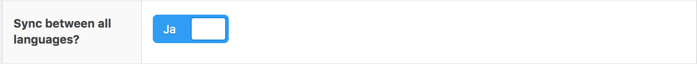

Polylang Sync Some Fields
=========================

Makes Polylang and ACF work together well. Attaches a switch to ACFs whether or not to synchronize ACF-content between all Polylang languages. 

Compatibility
-------------
Tested With WP 4.9, Polylang 2.3, ACF 5.6 PRO

How To Use
----------

* Download and install Plugin
* In Polylang settings: Choose synchronization "Custom Fields"
* For your custom fields, choose whether or not to "Sync between all languages?" 

Known Issues
------------

Reordering of Flexible Content Fields leads to:
    
* Maximum execution time of 30 seconds exceeded (...) wordpress/wp-includes/wp-db.php on line 1924
    
or:

* Maximum execution time of 30 seconds exceeded in (...) wordpress/wp-content/plugins/polylang-pro/modules/share-slug/share-post-slug.php on line 183
